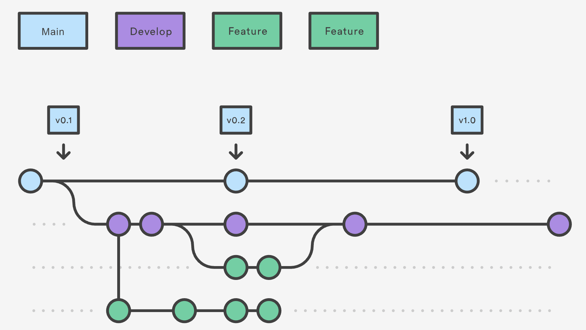

# Concepts git de base

## Gestion de versions

> La gestion de versions (en anglais : *version control* ou *versioning*) consiste à gérer l'ensemble des versions d'un ou plusieurs fichiers. (Wikipedia)

En particulier en développement informatique (mais pas uniquement), ces systèmes permettent de simplifier le stockage et le partage de fichiers, tout en conservant une trace de leur historique.

Dans le cadre d'un projet en équipe, cela permet de partager du code et de paralléliser le travail, tout en gardant de la visibilité sur ce qui est fait ou a été fait.

Lorsque l'on devient familier avec git, la mise en place est très rapide et permet d'économiser beaucoup de temps. Ici, nous présentons ce qu'est git et faisons la différence entre certains concepts à ne pas confondre.

Le but de cette fiche est de présenter simplement git dans ses grandes idées. [Cet article plus complet](https://thepilcrow.net/explaining-basic-concepts-git-and-github/) a servi de référence pour cette partie.

## Quelle différence entre git, GitHub et GitLab ?

**Git** est un VCS (*Version Control System*). C'est l'**outil** qui permet la gestion de versions.

**GitHub** et **GitLab** sont des **services**. Ils permettent de stocker des projets git en ligne. Chacun a ses avantages, mais ils sont globalement similaires.

## Le stockage du code

Un **repository** ("repo" en abbrévié) correspond à un projet dont l'historique est tracké par git. En clair, c'est un dossier contenant un dossier `.git/`.

Une **remote** correspond à repository hébergé sur le cloud (e.g. sur GitHub).

Lorsqu'on travaille sur un projet git sur son ordinateur, on travaille en **local**. **Aucun changement n'est sauvegardé en ligne tant qu'on n'a pas envoyé son travail à une remote** (avec `git push`).

Pour un même projet en local, on peut définir plusieurs remotes.

Ainsi, on peut prendre (`pull`) ou donner (`push`) du code à plusieurs remotes. C'est par exemple utile dans le cadre de projets open source, où cela permet d'avoir sa propre version du repository sans avoir besoin du contrôle de ceux qui proposent le code. On dit que l'on crée un **fork** du repository.

## Gérer ses changements

De façon générale, il faut retenir que git se souvient des **changements** que l'on apporte.

### L'historique du repository

Le **commit** est l'unité de base d'un historique git. Il faut le voir comme un **tampon** gardant une trace des changements qu'on a fait à un instant donné, par rapport au commit précédent dans l'historique. Lorsqu'on utilise `git commit`, on écrit une nouvelle ligne dans l'histoire du repository (que l'on consulte avec `git log`). **Ainsi, les messages de commit doivent être clairs et explicites.** En entreprise, ils sont souvent normalisés.

Une **branche** est simplement un pointeur vers un commit. Elles permettent de simplifier le suivi des historiques et le regroupement du travail. En pratique, **on visualise une branche comme une suite de commits**.

Une **stash** est un concept à part : elle permet de sauvegarder (**localement uniquement !**) un ensemble de changements. Elles sont pratiques pour mettre de côté des modifications qu'on veut déplacer d'une branche à l'autre.

### Gérer ses branches

Typiquement, on utilise des branches pour faire une partie d'un travail plus grand (e.g. feature d'un logiciel). Il faut ensuite regrouper son travail avec celui d'autres personnes sur une branche commune. 

On dit qu'on **merge** une branche A dans une autre branche B lorsqu'on apporte les commits de la branche A à la branche B.

> Source : [Atlassian Git Tutorial](https://www.atlassian.com/cs/git/tutorials/using-branches/git-merge)

Sur l'image ci-dessus, les commits de la branche *feature* sont ramenés (mergés) sur la branche *master* au sein d'un seul commit. On dit que l'on a **squashé** les commits de la branche *feature*.

### Gérer l'historique de ses branches

Réécrire ou modifier l'historique d'une branche peut avoir plusieurs intérêts : avoir plus de clarté à la relecture, corriger un message de commit, etc. 

**C'est toutefois une opération qui peut être dangereuse** si on réécrit l'historique d'une branche partagée.

On retient deux cas de figure simples :

- Si une branche est à l'origine d'autres branches sur lesquelles mes collègues travaillent, **réécrire son historique est très, très déconseillé**. On risque de créer des conflits dans les historiques de toutes les sous-branches.

- Si on travaille en local sur une branche qui nous est propre, réécrire son historique est relativement sûr, et même conseillé lorsqu'on se prépare à partager son code.

`git rebase` permet de **changer l'origine de sa branche** : autrement dit, on place l'origine de sa branche à un autre commit. L'intérêt principal du rebase est d'avoir un historique propre et lisible. Son inconvénient est qu'il est très facile de générer des conflits.

> Source : [This Medium article](https://fabisiakradoslaw.medium.com/understand-how-does-git-rebase-work-and-compare-with-git-merge-and-git-interactive-rebase-cce2c9775e43)

### Gérer les conflits

Un **conflit** a lieu lorsqu'on essaie de regrouper des changements incompatibles (typiquement, si deux personnes ont modifié le même fichier). Ils ont lieu lors des merge et des rebase. **Les conflits doivent être résolus manuellement et sont souvent très pénibles à gérer**. Une organisation efficace de l'équipe est la clé pour éviter les conflits.

### Echanger du code

`git fetch` permet de récupérer les informations sur les branches en remote. Aucun fichier n'est transféré, mais cela permet de savoir quels changements ont été apportés par nos collègues (branches), et on peut décider de les merger à une branche sur laquelle on travaille.

`git pull` est la combinaison de `git fetch` et `git merge`. Il est recommandé de puller les changements de la remote avant de commencer à travailler, pour éviter des conflits inutiles.

## Travailler en équipe

### Relire le code de ses pairs

Une fois le travail terminé, on va vouloir le pusher et le ramener sur la branche commune. Afin de s'assurer que le travail est aux standards de qualité de l'équipe (et d'éviter de laisser passer certaines erreurs), le code doit généralement être relu par un ou plusieurs collègues avant d'être mergé : on parle indifféremment de ***pull request*** (PR) ou de ***merge request*** (MR), donnant lieu à une *code review*.

### Conventions dans la gestion des branches

La gestion des branches est un point clé dans le développement à plusieurs. Au sein d'une équipe, on peut définir un **git flow**, qui sert de "règlement" pour la gestion des branches.

Ci-après figure un exemple simple de git flow. En pratique, certaines équipes mettent en place des flow plus complexes, mais reposant toujours sur ce même principe : 

> Source : [Atlassian Git Tutorial](https://www.atlassian.com/fr/git/tutorials/comparing-workflows/gitflow-workflow)

- La branche `main` (ou `master`) est l'image de ce qui est en production.

- La branche `develop` contient les features qui sont en cours de production. Ne sont ramenés sur cette branche que des modifications testées et approuvées. C'est une branche commune à toute l'équipe de développement, et il faut donc faire attention à ne pas réécrire son historique, ou à la "polluer" avec des commits de travail non terminé.

- Les branches de feature correspondent à des travaux en cours. Elles sont souvent à charge d'un seul développeur (ou d'un petit groupe) et sont vouées à disparaître quand les changements correspondants seront amenés sur `develop`. L'objectif est de pouvoir travailler librement sur une partie restreinte de l'application.

Chaque équipe est libre de définir différemment la raison d'être de chaque branche ou d'avoir d'autres conventions que celles-ci. L'important est que ces conventions soient respectées par tous les membres de l'équipe.

### Tags et versions

Les **tags** sont une fonction de git qui permettent d'affecter des étiquettes à certains commits (e.g. pour les retrouver plus facilement par la suite).

Les **versions** d'une application sont extérieures à git. Il s'agit de définir quelles fonctionnalités et features figurent dans une release de l'application (autrement dit, ce qu'on ajoute à une certaine mise à jour). Là encore, chaque équipe décide de ses conventions pour le nommage des versions. Des guidelines très détaillées sont données sur [cette page](https://semver.org/).

Les tags peuvent être utilisés pour marquer les versions, mais pas seulement.
